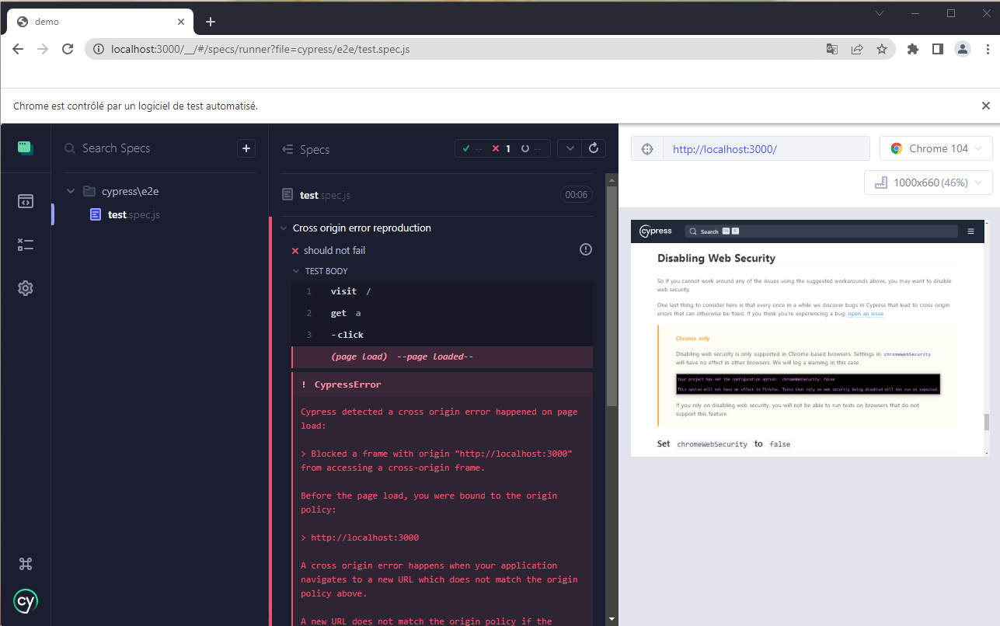

# demo
To repoduce the cross origin error
```
npm run go
```
then
```
npm run cy:view
```
Finally run the `test.spec.js` file.

You can run the following to run in headless mode :
```
npm run cy
``` 




